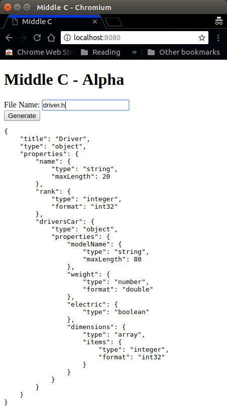

# Middle C

Generate JSON Schema from C/C++ structs or classes using [libclang](https://github.com/tjfontaine/node-libclang).

## Requirements
* clang version 4.0.0
* node version 6 or later

## Usage Example
### Command Line
```
bin/middle-c-cli.js -d examples/ -I examples/ driver.h
```
### Web GUI
```
docker-compose up
```
Point your browser to localhost:8080 . . .



## Road Map
1. Handle enums
1. Improve GUI
